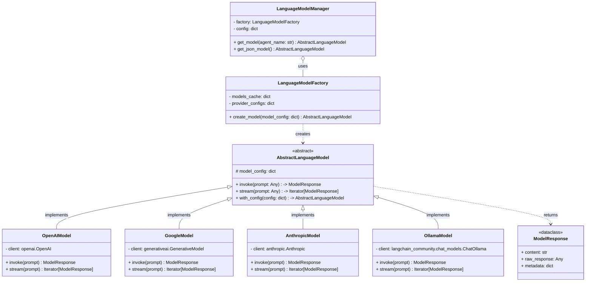

# LLM 整合層重構技術規格

**版本：** 1.0
**狀態：** 已批准

## 1. 總覽

目前的 `LanguageModelManager` 與 LangChain 的 `ChatOpenAI` 類別過於緊密耦合，此設計限制了系統整合非 OpenAI 相容模型以及利用各供應商獨特功能的能力。本次重構旨在引入一個供應商中立的抽象層，透過工廠模式動態載入模型，並提供更靈活的設定檔結構，以實現高度的擴充性與可維護性。

## 2. 架構設計

新的架構將圍繞以下幾個核心概念構建：

*   **`AbstractLanguageModel` (ABC)**：一個定義通用模型行為的抽象基礎類別。
*   **具體模型實作 (Concrete Implementations)**：為每個 LLM 供應商（如 OpenAI, Google, Anthropic）提供一個繼承自 `AbstractLanguageModel` 的具體類別。
*   **`LanguageModelFactory`**：一個工廠類別，負責根據設定檔解析、實例化並快取對應的模型。
*   **`LanguageModelManager` (重構後)**：作為系統與模型層互動的主要入口，其內部邏輯將大幅簡化，主要委託工廠來完成模型建立。
*   **擴充的設定檔 (`config.yaml`)**：支援各供應商的客製化參數。

### 2.1. 類別關係圖 (Mermaid)



## 3. 元件詳解

### 3.1. 抽象層設計 (`AbstractLanguageModel`)

這將是一個使用 Python `abc` 模組的抽象基礎類別，定義所有模型供應商實作都必須遵守的契約。

**偽代碼：**

```python
from abc import ABC, abstractmethod
from dataclasses import dataclass
from typing import Any, Iterator, Dict

@dataclass
class ModelResponse:
    """A standardized data structure for model responses."""
    content: str
    raw_response: Any = None # The original response from the provider's SDK
    metadata: Dict[str, Any] = None # For usage stats, finish reasons, etc.

class AbstractLanguageModel(ABC):
    """
    Abstract Base Class for all language model implementations.
    """
    def __init__(self, model_config: Dict[str, Any]):
        self.model_config = model_config
        self._initialize_client()

    @abstractmethod
    def _initialize_client(self):
        """Initializes the provider-specific client (e.g., OpenAI(), Anthropic())."""
        pass

    @abstractmethod
    def invoke(self, prompt: Any) -> ModelResponse:
        """
        Sends a single request to the model and returns the complete response.
        """
        pass

    @abstractmethod
    def stream(self, prompt: Any) -> Iterator[ModelResponse]:
        """
        Sends a request and streams the response back chunk by chunk.
        """
        pass

    def with_config(self, config: Dict[str, Any]) -> 'AbstractLanguageModel':
        """
        Allows overriding model parameters for a single call, similar to LangChain's .with_config().
        This can be implemented to return a new instance with updated config.
        """
        new_config = {**self.model_config, **config}
        return self.__class__(new_config)

```

### 3.2. 工廠模式 (`LanguageModelFactory`)

工廠是新架構的核心，它將模型建立的複雜邏輯從 `LanguageModelManager` 中分離出來。

**偽代碼：**

```python
# Mapping of provider names to their corresponding implementation classes
PROVIDER_MAP = {
    'openai': OpenAIModel,
    'google': GoogleModel,
    'anthropic': AnthropicModel,
    'ollama': OllamaModel,
    # New providers can be easily added here
}

class LanguageModelFactory:
    def __init__(self, provider_configs: Dict[str, Any]):
        self._models_cache = {} # Cache to store initialized model instances
        self.provider_configs = provider_configs

    def create_model(self, model_name: str, model_config: Dict[str, Any]) -> AbstractLanguageModel:
        """
        Creates and returns a language model instance based on the configuration.
        """
        cache_key = model_name
        if cache_key in self._models_cache:
            return self._models_cache[cache_key]

        provider = model_config.get('provider')
        if not provider or provider not in PROVIDER_MAP:
            raise ValueError(f"Unsupported or missing provider: {provider}")

        base_provider_config = self.provider_configs.get(provider, {})
        final_config = {**base_provider_config, **model_config}
        ModelClass = PROVIDER_MAP[provider]
        model_instance = ModelClass(model_config=final_config)
        self._models_cache[cache_key] = model_instance
        return model_instance
```

### 3.3. 設定檔結構 (`config.yaml`)

為了支援各供應商的客製化參數，我們需要一個更具結構性的設定檔。

**建議的 `config.yaml` 結構：**

```yaml
# 1. Provider Configurations: Central place for provider-level settings.
provider_configs:
  openai:
    api_key_env: OPENAI_API_KEY
  google:
    api_key_env: GOOGLE_API_KEY
    safety_settings:
      - category: HARM_CATEGORY_HARASSMENT
        threshold: BLOCK_NONE
  anthropic:
    api_key_env: ANTHROPIC_API_KEY
  ollama:
    base_url: "http://localhost:11434/v1"

# 2. Model Definitions: Define specific model instances.
models:
  default:
    provider: openai
    model_name: gpt-4o-mini
    temperature: 0.2
  default_json:
    provider: openai
    model_name: gpt-4o
    response_format:
      type: json_object
  code_generator:
    provider: anthropic
    model_name: claude-3-opus-20240229
    max_tokens: 4096
  report_writer:
    provider: google
    model_name: gemini-1.5-pro-latest

# 3. Agent to Model Mapping: Map agents to the defined models.
agent_models:
  default: default
  json_model: default_json
  code_agent: code_generator
  report_agent: report_writer
```

### 3.4. `LanguageModelManager` (重構後)

`LanguageModelManager` 的職責將被簡化，作為一個高階 API，協調設定檔和工廠。

**偽代碼：**

```python
class LanguageModelManager:
    def __init__(self, config_path='config.yaml'):
        self.config = self._load_config(config_path)
        provider_configs = self.config.get('provider_configs', {})
        self.model_definitions = self.config.get('models', {})
        self.agent_map = self.config.get('agent_models', {})
        self.factory = LanguageModelFactory(provider_configs)

    def _load_config(self, path):
        # ... (logic to load YAML file) ...
        pass

    def get_model(self, agent_name: str = None) -> AbstractLanguageModel:
        model_key = self.agent_map.get(agent_name, self.agent_map.get('default', 'default'))
        model_config = self.model_definitions[model_key]
        return self.factory.create_model(model_name=model_key, model_config=model_config)

    def get_json_model(self) -> AbstractLanguageModel:
        model_key = self.agent_map.get('json_model', 'default_json')
        model_config = self.model_definitions[model_key]
        return self.factory.create_model(model_name=model_key, model_config=model_config)
```

## 4. 遷移路徑與注意事項

1.  **實作核心類別**：開發 `AbstractLanguageModel`、`ModelResponse` 和 `LanguageModelFactory`。
2.  **開發具體模型類別**：為 `OpenAI` 開發第一個具體實作 `OpenAIModel`。
3.  **更新設定檔**：將現有的 `config.yaml.example` 遷移到新的結構。
4.  **重構 `LanguageModelManager`**：修改 `LanguageModelManager` 以使用新的工廠模式。
5.  **測試**：確保 `get_model()` 和 `get_json_model()` 的行為與重構前一致。
6.  **逐步擴充**：在新的架構下，為 `Google`、`Anthropic`、`Ollama` 等逐一添加原生的具體模型類別。
7.  **重要提醒**：在實作各供應商的具體模型類別時，務必參考其最新的官方文件，使用推薦的 SDK 和最新的模型名稱，以確保功能的穩定性與效能。