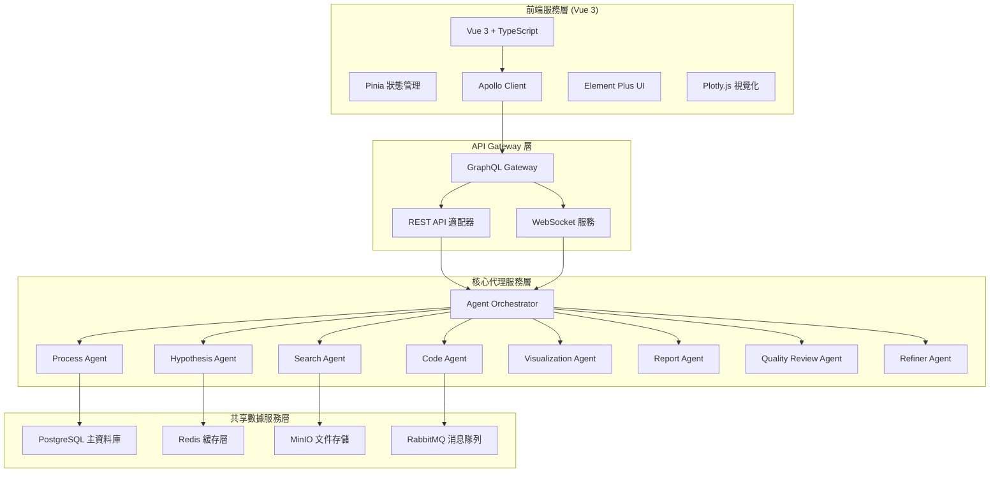
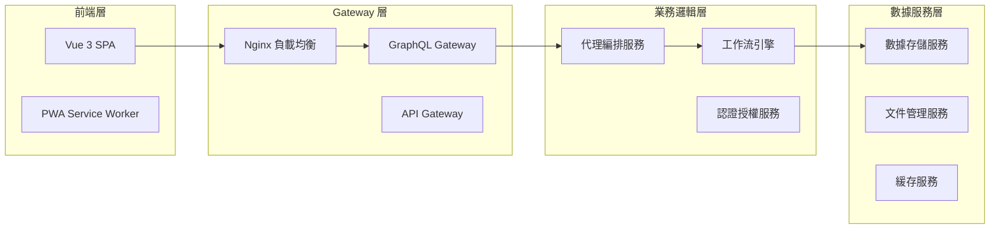
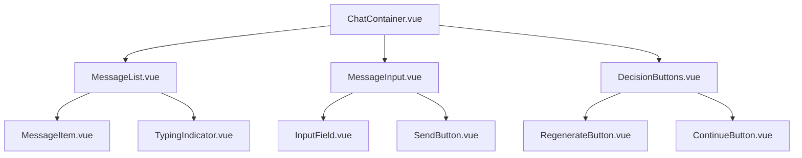
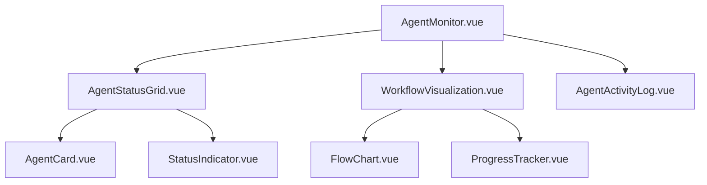
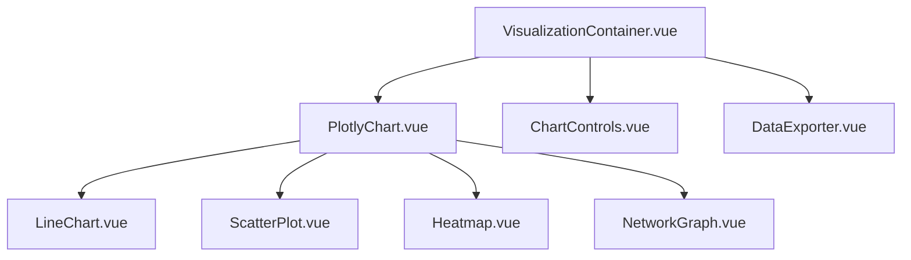
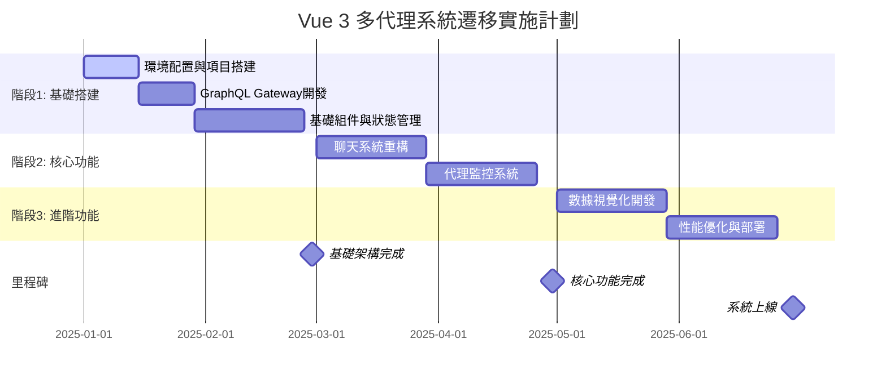
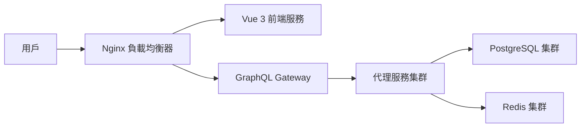

# Vue 3 多代理數據分析系統現代化架構方案

## 📋 項目概述

本文檔詳細說明了將現有多代理數據分析系統從原生JavaScript ES6遷移到Vue 3現代框架的完整架構方案和實施計劃。

### 🎯 系統目標
- 採用Vue 3 + TypeScript + Composition API現代化前端架構
- 建立混合微服務架構：核心代理服務 + 獨立前端服務 + 共享數據服務
- 使用GraphQL訂閱 + Apollo Client實現高效實時通訊
- 整合Plotly.js進行交互式數據分析與視覺化
- 6個月階段性遷移，確保業務連續性

## 🏗️ 系統架構設計

### 整體架構圖



### 微服務架構設計

#### 服務分層架構


## 🛠️ 技術棧選型

### 前端技術棧

#### 核心框架
```json
{
  "vue": "^3.4.0",
  "@vue/typescript": "^5.3.0",
  "typescript": "^5.3.0",
  "vite": "^5.0.0"
}
```

#### 狀態管理與路由
```json
{
  "pinia": "^2.1.0",
  "vue-router": "^4.2.0",
  "@pinia/nuxt": "^0.5.0"
}
```

#### GraphQL 與 API 通訊
```json
{
  "@apollo/client": "^3.8.0",
  "@vue/apollo-composable": "^4.0.0",
  "graphql": "^16.8.0",
  "graphql-ws": "^5.14.0"
}
```

#### UI 組件與樣式
```json
{
  "element-plus": "^2.4.0",
  "@element-plus/icons-vue": "^2.1.0",
  "tailwindcss": "^3.3.0",
  "@tailwindcss/typography": "^0.5.0"
}
```

#### 數據視覺化
```json
{
  "plotly.js": "^2.27.0",
  "@types/plotly.js": "^2.12.0",
  "vue-plotly": "^1.1.0",
  "d3": "^7.8.0"
}
```

#### 開發工具
```json
{
  "eslint": "^8.56.0",
  "@typescript-eslint/eslint-plugin": "^6.14.0",
  "prettier": "^3.1.0",
  "husky": "^8.0.0",
  "lint-staged": "^15.2.0",
  "@vitejs/plugin-vue": "^4.5.0"
}
```

### 後端技術棧升級

#### GraphQL 服務
```python
# requirements.txt
strawberry-graphql[fastapi]==0.214.0
fastapi==0.104.0
uvicorn[standard]==0.24.0
graphql-core==3.2.3
```

#### 數據庫與緩存
```python
# 數據庫
asyncpg==0.29.0
sqlalchemy[asyncio]==2.0.23
alembic==1.13.0

# 緩存
redis[hiredis]==5.0.1
aioredis==2.0.1
```

#### 消息隊列
```python
# 消息隊列
celery[redis]==5.3.4
kombu==5.3.4
```

## 📁 項目結構設計

### Vue 3 前端項目結構
```
vue-frontend/
├── public/                          # 靜態資源
│   ├── favicon.ico
│   └── manifest.json
├── src/
│   ├── components/                  # 可復用組件
│   │   ├── base/                   # 基礎UI組件
│   │   │   ├── BaseButton.vue
│   │   │   ├── BaseInput.vue
│   │   │   ├── BaseModal.vue
│   │   │   └── BaseTable.vue
│   │   ├── chat/                   # 聊天相關組件
│   │   │   ├── ChatContainer.vue
│   │   │   ├── MessageList.vue
│   │   │   ├── MessageItem.vue
│   │   │   ├── MessageInput.vue
│   │   │   ├── DecisionButtons.vue
│   │   │   └── TypingIndicator.vue
│   │   ├── visualization/          # 視覺化組件
│   │   │   ├── PlotlyChart.vue
│   │   │   ├── ChartControls.vue
│   │   │   ├── DataExporter.vue
│   │   │   ├── LineChart.vue
│   │   │   ├── ScatterPlot.vue
│   │   │   └── Heatmap.vue
│   │   ├── agent/                  # 代理相關組件
│   │   │   ├── AgentMonitor.vue
│   │   │   ├── AgentCard.vue
│   │   │   ├── StatusIndicator.vue
│   │   │   ├── WorkflowVisualization.vue
│   │   │   └── ProgressTracker.vue
│   │   ├── file/                   # 文件管理組件
│   │   │   ├── FileManager.vue
│   │   │   ├── FileList.vue
│   │   │   ├── FileUpload.vue
│   │   │   └── FilePreview.vue
│   │   └── layout/                 # 佈局組件
│   │       ├── AppHeader.vue
│   │       ├── AppSidebar.vue
│   │       ├── AppFooter.vue
│   │       └── AppLayout.vue
│   ├── views/                      # 頁面組件
│   │   ├── Dashboard.vue
│   │   ├── ChatInterface.vue
│   │   ├── AgentMonitor.vue
│   │   ├── DataVisualization.vue
│   │   ├── FileManager.vue
│   │   └── Settings.vue
│   ├── stores/                     # Pinia stores
│   │   ├── index.ts               # Store 入口
│   │   ├── chat.ts                # 聊天狀態管理
│   │   ├── agents.ts              # 代理狀態管理
│   │   ├── files.ts               # 文件狀態管理
│   │   ├── visualization.ts       # 視覺化狀態管理
│   │   └── auth.ts                # 認證狀態管理
│   ├── graphql/                   # GraphQL 查詢和訂閱
│   │   ├── client.ts              # Apollo Client 配置
│   │   ├── queries/               # GraphQL 查詢
│   │   │   ├── agents.ts
│   │   │   ├── messages.ts
│   │   │   └── files.ts
│   │   ├── mutations/             # GraphQL 變更
│   │   │   ├── sendMessage.ts
│   │   │   └── makeDecision.ts
│   │   └── subscriptions/         # GraphQL 訂閱
│   │       ├── messageAdded.ts
│   │       ├── agentStateChanged.ts
│   │       └── systemStateUpdated.ts
│   ├── composables/               # Vue 3 Composition 函數
│   │   ├── useChat.ts
│   │   ├── useAgents.ts
│   │   ├── useFiles.ts
│   │   ├── useVisualization.ts
│   │   └── useWebSocket.ts
│   ├── types/                     # TypeScript 類型定義
│   │   ├── api.ts
│   │   ├── agent.ts
│   │   ├── chat.ts
│   │   ├── file.ts
│   │   └── visualization.ts
│   ├── utils/                     # 工具函數
│   │   ├── format.ts
│   │   ├── validation.ts
│   │   ├── constants.ts
│   │   └── helpers.ts
│   ├── router/                    # Vue Router 配置
│   │   ├── index.ts
│   │   ├── guards.ts
│   │   └── routes.ts
│   ├── assets/                    # 資源文件
│   │   ├── styles/
│   │   │   ├── main.css
│   │   │   ├── variables.css
│   │   │   └── components.css
│   │   └── images/
│   ├── App.vue                    # 根組件
│   └── main.ts                    # 應用入口
├── tests/                         # 測試文件
│   ├── unit/
│   ├── integration/
│   └── e2e/
├── docs/                          # 文檔
├── .env                          # 環境變數
├── .env.development              # 開發環境變數
├── .env.production               # 生產環境變數
├── package.json
├── tsconfig.json
├── vite.config.ts
├── tailwind.config.js
├── eslint.config.js
└── README.md
```

### 後端服務結構升級
```
backend/
├── services/
│   ├── graphql-gateway/           # GraphQL Gateway 服務
│   │   ├── schema/
│   │   ├── resolvers/
│   │   └── subscriptions/
│   ├── agent-service/             # 代理編排服務
│   │   ├── agents/               # 現有8個代理
│   │   ├── workflow/
│   │   └── orchestrator/
│   └── data-service/              # 數據服務
│       ├── models/
│       ├── repositories/
│       └── migrations/
├── shared/                        # 共享組件
│   ├── database/
│   ├── messaging/
│   └── authentication/
└── docker/                       # 容器配置
    ├── docker-compose.yml
    └── Dockerfile.*
```

## 🔧 核心組件設計

### 1. ChatInterface 組件架構



#### ChatContainer.vue 實現重點
```typescript
// src/components/chat/ChatContainer.vue
<template>
  <div class="chat-container">
    <MessageList 
      :messages="messages" 
      :loading="isLoading"
      @scroll-to-bottom="handleScrollToBottom"
    />
    <MessageInput 
      v-if="!needsDecision"
      :disabled="isProcessing"
      @send="handleSendMessage"
    />
    <DecisionButtons 
      v-if="needsDecision"
      @decision="handleDecision"
    />
  </div>
</template>

<script setup lang="ts">
import { useChat } from '@/composables/useChat'
import { useChatStore } from '@/stores/chat'

const chatStore = useChatStore()
const { messages, isLoading, isProcessing, needsDecision } = useChat()

const handleSendMessage = async (message: string) => {
  await chatStore.sendMessage(message)
}

const handleDecision = async (decision: DecisionType) => {
  await chatStore.makeDecision(decision)
}
</script>
```

### 2. AgentMonitor 組件設計



#### 代理狀態即時監控
```typescript
// src/composables/useAgents.ts
import { useSubscription, useQuery } from '@vue/apollo-composable'
import { AGENT_STATE_SUBSCRIPTION, AGENTS_QUERY } from '@/graphql/agents'

export function useAgents() {
  const { result: agentsData, loading } = useQuery(AGENTS_QUERY)
  
  const { result: stateUpdate } = useSubscription(
    AGENT_STATE_SUBSCRIPTION,
    null,
    {
      onResult: (result) => {
        // 處理即時狀態更新
        updateAgentState(result.data.agentStateChanged)
      }
    }
  )

  const agents = computed(() => agentsData.value?.agents || [])
  
  return {
    agents,
    loading,
    isAgentActive: (agentId: string) => 
      agents.value.find(a => a.id === agentId)?.status === 'ACTIVE'
  }
}
```

### 3. DataVisualization 組件架構



#### Plotly.js 整合實現
```typescript
// src/components/visualization/PlotlyChart.vue
<template>
  <div ref="plotContainer" class="plotly-chart"></div>
</template>

<script setup lang="ts">
import Plotly from 'plotly.js-dist'
import { useVisualization } from '@/composables/useVisualization'

interface Props {
  data: PlotData[]
  layout?: Partial<Plotly.Layout>
  config?: Partial<Plotly.Config>
}

const props = withDefaults(defineProps<Props>(), {
  layout: () => ({}),
  config: () => ({
    responsive: true,
    displayModeBar: true
  })
})

const plotContainer = ref<HTMLElement>()
const { formatData, getDefaultLayout } = useVisualization()

onMounted(async () => {
  if (plotContainer.value) {
    const formattedData = formatData(props.data)
    const finalLayout = { ...getDefaultLayout(), ...props.layout }
    
    await Plotly.newPlot(
      plotContainer.value,
      formattedData,
      finalLayout,
      props.config
    )
  }
})

watch(() => props.data, async (newData) => {
  if (plotContainer.value) {
    const formattedData = formatData(newData)
    await Plotly.react(plotContainer.value, formattedData)
  }
}, { deep: true })
</script>
```

## 🔗 GraphQL 架構設計

### Schema 定義
```graphql
# schema.graphql

type Query {
  # 代理相關查詢
  agents: [Agent!]!
  agent(id: ID!): Agent
  
  # 消息相關查詢
  messages(limit: Int = 50, offset: Int = 0): [Message!]!
  
  # 系統狀態查詢
  systemState: SystemState!
  
  # 文件相關查詢
  files(path: String): [FileInfo!]!
  file(id: ID!): FileInfo
}

type Mutation {
  # 消息操作
  sendMessage(input: SendMessageInput!): Message!
  
  # 決策操作
  makeDecision(input: DecisionInput!): DecisionResult!
  
  # 文件操作
  uploadFile(input: FileUploadInput!): FileInfo!
  deleteFile(id: ID!): Boolean!
}

type Subscription {
  # 即時消息更新
  messageAdded: Message!
  
  # 代理狀態變更
  agentStateChanged: AgentStateUpdate!
  
  # 系統狀態更新
  systemStateUpdated: SystemState!
  
  # 工作流程進度
  workflowProgress: WorkflowProgress!
}

# 類型定義
type Agent {
  id: ID!
  name: String!
  type: AgentType!
  status: AgentStatus!
  currentTask: String
  lastActivity: DateTime!
  performance: AgentPerformance
}

type Message {
  id: ID!
  content: String!
  sender: String!
  timestamp: DateTime!
  type: MessageType!
  metadata: MessageMetadata
}

type SystemState {
  currentPhase: String!
  activeAgents: [String!]!
  needsDecision: Boolean!
  hypothesis: String
  processStatus: String
  qualityReview: String
}

enum AgentType {
  PROCESS
  HYPOTHESIS
  SEARCH
  CODE
  VISUALIZATION
  REPORT
  QUALITY_REVIEW
  REFINER
}

enum AgentStatus {
  IDLE
  ACTIVE
  PROCESSING
  WAITING
  ERROR
}

enum MessageType {
  USER
  AGENT
  SYSTEM
  DECISION_REQUEST
}

input SendMessageInput {
  content: String!
  type: MessageType = USER
}

input DecisionInput {
  decision: DecisionType!
  context: String
}

enum DecisionType {
  REGENERATE_HYPOTHESIS
  CONTINUE_RESEARCH
  APPROVE_REPORT
  REQUEST_REVISION
}
```

### Apollo Client 配置
```typescript
// src/graphql/client.ts
import { ApolloClient, InMemoryCache, createHttpLink, split } from '@apollo/client/core'
import { GraphQLWsLink } from '@apollo/client/link/subscriptions'
import { getMainDefinition } from '@apollo/client/utilities'
import { createClient } from 'graphql-ws'

// HTTP 連接
const httpLink = createHttpLink({
  uri: import.meta.env.VITE_GRAPHQL_HTTP_URL || 'http://localhost:8000/graphql',
})

// WebSocket 連接
const wsLink = new GraphQLWsLink(
  createClient({
    url: import.meta.env.VITE_GRAPHQL_WS_URL || 'ws://localhost:8000/graphql/ws',
  })
)

// 分離 HTTP 和 WebSocket 請求
const splitLink = split(
  ({ query }) => {
    const definition = getMainDefinition(query)
    return (
      definition.kind === 'OperationDefinition' &&
      definition.operation === 'subscription'
    )
  },
  wsLink,
  httpLink,
)

// Apollo Client 實例
export const apolloClient = new ApolloClient({
  link: splitLink,
  cache: new InMemoryCache({
    typePolicies: {
      Query: {
        fields: {
          messages: {
            merge(existing = [], incoming) {
              return [...existing, ...incoming]
            }
          }
        }
      }
    }
  }),
  defaultOptions: {
    watchQuery: {
      errorPolicy: 'all'
    }
  }
})
```

## 📊 狀態管理設計 (Pinia)

### Chat Store 實現
```typescript
// src/stores/chat.ts
import { defineStore } from 'pinia'
import { useMutation, useSubscription } from '@vue/apollo-composable'
import { SEND_MESSAGE_MUTATION, MESSAGE_ADDED_SUBSCRIPTION } from '@/graphql/chat'

export const useChatStore = defineStore('chat', () => {
  // 狀態
  const messages = ref<Message[]>([])
  const isProcessing = ref(false)
  const needsDecision = ref(false)
  const currentTypingAgent = ref<string | null>(null)

  // GraphQL Mutations
  const { mutate: sendMessageMutation } = useMutation(SEND_MESSAGE_MUTATION)
  
  // GraphQL Subscriptions
  const { onResult: onMessageAdded } = useSubscription(MESSAGE_ADDED_SUBSCRIPTION)
  
  // 監聽新消息
  onMessageAdded((result) => {
    if (result.data?.messageAdded) {
      addMessage(result.data.messageAdded)
    }
  })

  // Actions
  const addMessage = (message: Message) => {
    messages.value.push(message)
  }

  const sendMessage = async (content: string) => {
    try {
      isProcessing.value = true
      
      const result = await sendMessageMutation({
        input: { content, type: 'USER' }
      })
      
      if (result?.data?.sendMessage) {
        addMessage(result.data.sendMessage)
      }
    } catch (error) {
      console.error('發送消息失敗:', error)
      throw error
    } finally {
      isProcessing.value = false
    }
  }

  const makeDecision = async (decision: DecisionType) => {
    try {
      isProcessing.value = true
      needsDecision.value = false
      
      // 實現決策邏輯
      await sendMessageMutation({
        input: { 
          content: `決策: ${decision}`, 
          type: 'DECISION_REQUEST' 
        }
      })
    } catch (error) {
      console.error('決策失敗:', error)
      throw error
    } finally {
      isProcessing.value = false
    }
  }

  const clearMessages = () => {
    messages.value = []
  }

  // Getters
  const lastMessage = computed(() => 
    messages.value[messages.value.length - 1]
  )
  
  const userMessages = computed(() => 
    messages.value.filter(m => m.type === 'USER')
  )
  
  const agentMessages = computed(() => 
    messages.value.filter(m => m.type === 'AGENT')
  )

  return {
    // State
    messages: readonly(messages),
    isProcessing: readonly(isProcessing),
    needsDecision: readonly(needsDecision),
    currentTypingAgent: readonly(currentTypingAgent),
    
    // Actions
    addMessage,
    sendMessage,
    makeDecision,
    clearMessages,
    
    // Getters
    lastMessage,
    userMessages,
    agentMessages
  }
})
```

### Agent Store 實現
```typescript
// src/stores/agents.ts
import { defineStore } from 'pinia'
import { useQuery, useSubscription } from '@vue/apollo-composable'
import { AGENTS_QUERY, AGENT_STATE_SUBSCRIPTION } from '@/graphql/agents'

export const useAgentStore = defineStore('agents', () => {
  const agents = ref<Agent[]>([])
  const currentWorkflow = ref<WorkflowState | null>(null)
  
  // GraphQL Query
  const { result: agentsResult, loading } = useQuery(AGENTS_QUERY)
  
  // GraphQL Subscription
  const { onResult: onAgentStateChanged } = useSubscription(AGENT_STATE_SUBSCRIPTION)
  
  // 監聽代理狀態變更
  onAgentStateChanged((result) => {
    if (result.data?.agentStateChanged) {
      updateAgentState(result.data.agentStateChanged)
    }
  })
  
  // 監聽查詢結果
  watchEffect(() => {
    if (agentsResult.value?.agents) {
      agents.value = agentsResult.value.agents
    }
  })

  const updateAgentState = (update: AgentStateUpdate) => {
    const agentIndex = agents.value.findIndex(a => a.id === update.agentId)
    if (agentIndex !== -1) {
      agents.value[agentIndex] = { ...agents.value[agentIndex], ...update.changes }
    }
  }

  // Getters
  const activeAgents = computed(() => 
    agents.value.filter(agent => agent.status === 'ACTIVE')
  )
  
  const agentsByType = computed(() => 
    agents.value.reduce((acc, agent) => {
      acc[agent.type] = agent
      return acc
    }, {} as Record<AgentType, Agent>)
  )

  return {
    agents: readonly(agents),
    currentWorkflow: readonly(currentWorkflow),
    loading: readonly(loading),
    activeAgents,
    agentsByType,
    updateAgentState
  }
})
```

## ⚙️ 開發環境配置

### Vite 配置
```typescript
// vite.config.ts
import { defineConfig } from 'vite'
import vue from '@vitejs/plugin-vue'
import { resolve } from 'path'

export default defineConfig({
  plugins: [
    vue({
      script: {
        defineModel: true,
        propsDestructure: true
      }
    })
  ],
  
  resolve: {
    alias: {
      '@': resolve(__dirname, 'src'),
      '@components': resolve(__dirname, 'src/components'),
      '@stores': resolve(__dirname, 'src/stores'),
      '@types': resolve(__dirname, 'src/types'),
      '@utils': resolve(__dirname, 'src/utils')
    },
  },
  
  server: {
    port: 3000,
    proxy: {
      '/graphql': {
        target: 'http://localhost:8000',
        changeOrigin: true,
        ws: true
      },
      '/api': {
        target: 'http://localhost:5001',
        changeOrigin: true
      }
    }
  },
  
  build: {
    target: 'es2015',
    rollupOptions: {
      output: {
        manualChunks: {
          vendor: ['vue', 'vue-router'],
          pinia: ['pinia'],
          apollo: ['@apollo/client', '@vue/apollo-composable'],
          ui: ['element-plus'],
          visualization: ['plotly.js', 'd3']
        }
      }
    },
    chunkSizeWarningLimit: 1000
  },
  
  define: {
    __VUE_OPTIONS_API__: false,
    __VUE_PROD_DEVTOOLS__: false
  }
})
```

### TypeScript 配置
```json
// tsconfig.json
{
  "compilerOptions": {
    "target": "ES2020",
    "useDefineForClassFields": true,
    "lib": ["ES2020", "DOM", "DOM.Iterable"],
    "module": "ESNext",
    "skipLibCheck": true,
    "moduleResolution": "bundler",
    "allowImportingTsExtensions": true,
    "resolveJsonModule": true,
    "isolatedModules": true,
    "noEmit": true,
    "jsx": "preserve",
    "strict": true,
    "noUnusedLocals": true,
    "noUnusedParameters": true,
    "noFallthroughCasesInSwitch": true,
    "baseUrl": ".",
    "paths": {
      "@/*": ["src/*"],
      "@components/*": ["src/components/*"],
      "@stores/*": ["src/stores/*"],
      "@types/*": ["src/types/*"],
      "@utils/*": ["src/utils/*"]
    }
  },
  "include": ["src/**/*.ts", "src/**/*.d.ts", "src/**/*.tsx", "src/**/*.vue"],
  "references": [{ "path": "./tsconfig.node.json" }]
}
```

### ESLint 配置
```javascript
// eslint.config.js
import js from '@eslint/js'
import pluginVue from 'eslint-plugin-vue'
import * as parserVue from 'vue-eslint-parser'
import configTypescript from '@typescript-eslint/eslint-plugin'
import parserTypescript from '@typescript-eslint/parser'

export default [
  js.configs.recommended,
  ...pluginVue.configs['flat/recommended'],
  {
    files: ['**/*.vue', '**/*.ts'],
    languageOptions: {
      parser: parserVue,
      parserOptions: {
        parser: parserTypescript,
        extraFileExtensions: ['.vue'],
        sourceType: 'module'
      }
    },
    plugins: {
      '@typescript-eslint': configTypescript
    },
    rules: {
      // Vue 規則
      'vue/multi-word-component-names': 'off',
      'vue/component-definition-name-casing': ['error', 'PascalCase'],
      'vue/component-name-in-template-casing': ['error', 'PascalCase'],
      
      // TypeScript 規則
      '@typescript-eslint/no-unused-vars': 'error',
      '@typescript-eslint/explicit-function-return-type': 'off',
      '@typescript-eslint/explicit-module-boundary-types': 'off',
      
      // 通用規則
      'no-console': process.env.NODE_ENV === 'production' ? 'warn' : 'off',
      'no-debugger': process.env.NODE_ENV === 'production' ? 'warn' : 'off'
    }
  }
]
```

### TailwindCSS 配置
```javascript
// tailwind.config.js
export default {
  content: [
    './index.html',
    './src/**/*.{vue,js,ts,jsx,tsx}',
  ],
  theme: {
    extend: {
      colors: {
        primary: {
          50: '#eff6ff',
          500: '#3b82f6',
          600: '#2563eb',
          700: '#1d4ed8',
        },
        agent: {
          active: '#10b981',
          idle: '#6b7280',
          processing: '#f59e0b',
          error: '#ef4444'
        }
      },
      fontFamily: {
        sans: ['Inter', 'system-ui', 'sans-serif'],
        mono: ['Fira Code', 'monospace']
      },
      animation: {
        'typing': 'typing 1.4s infinite',
        'pulse-slow': 'pulse 3s cubic-bezier(0.4, 0, 0.6, 1) infinite'
      }
    },
  },
  plugins: [
    require('@tailwindcss/typography'),
    require('@tailwindcss/forms')
  ],
}
```

## 📅 詳細實施計劃

### 階段 1: 基礎架構搭建 (第1-2個月)

#### 第1個月：開發環境與核心架構
**週1-2: 環境搭建**
- [ ] 建立 Vue 3 + Vite + TypeScript 項目
- [ ] 配置 ESLint, Prettier, Husky
- [ ] 設置 TailwindCSS + Element Plus
- [ ] 建立基礎項目結構

**週3-4: GraphQL Gateway 開發**
- [ ] 設計 GraphQL Schema
- [ ] 實現 Strawberry GraphQL 服務
- [ ] 配置 Apollo Client
- [ ] 建立 WebSocket 訂閱機制

#### 第2個月：基礎組件開發
**週1-2: 核心組件**
- [ ] 實現 BaseButton, BaseInput 等基礎組件
- [ ] 開發 AppLayout, AppHeader, AppSidebar
- [ ] 建立路由系統
- [ ] 實現響應式佈局

**週3-4: 狀態管理**
- [ ] 設置 Pinia stores
- [ ] 實現 chat, agents, files stores
- [ ] 建立 Apollo Client 整合
- [ ] 實現基礎的 GraphQL 查詢

### 階段 2: 核心功能遷移 (第3-4個月)

#### 第3個月：聊天系統重構
**週1-2: 聊天界面**
- [ ] 遷移 ChatContainer 組件
- [ ] 實現 MessageList 和 MessageItem
- [ ] 開發 MessageInput 組件
- [ ] 實現即時訊息功能

**週3-4: 決策系統**
- [ ] 實現 DecisionButtons 組件
- [ ] 建立決策處理邏輯
- [ ] 整合代理決策流程
- [ ] 實現狀態同步機制

#### 第4個月：代理監控系統
**週1-2: 代理狀態監控**
- [ ] 開發 AgentMonitor 主界面
- [ ] 實現 AgentCard 組件
- [ ] 建立即時狀態更新
- [ ] 實現代理性能追蹤

**週3-4: 工作流可視化**
- [ ] 開發 WorkflowVisualization 組件
- [ ] 實現流程圖展示
- [ ] 建立進度追蹤功能
- [ ] 整合代理協作視覺化

### 階段 3: 進階功能開發 (第5-6個月)

#### 第5個月：數據視覺化
**週1-2: Plotly.js 整合**
- [ ] 實現 PlotlyChart 基礎組件
- [ ] 開發 LineChart, ScatterPlot 組件
- [ ] 建立 Heatmap 和 NetworkGraph
- [ ] 實現圖表控制面板

**週3-4: 互動式分析**
- [ ] 實現數據篩選功能
- [ ] 建立圖表導出功能
- [ ] 開發即時數據更新
- [ ] 實現圖表聯動效果

#### 第6個月：優化與部署
**週1-2: 性能優化**
- [ ] 實現組件懶加載
- [ ] 優化 Bundle 大小
- [ ] 實現虛擬化列表
- [ ] 優化 GraphQL 查詢

**週3-4: 部署與測試**
- [ ] Docker 容器化
- [ ] 建立 CI/CD 管道
- [ ] 性能測試與調優
- [ ] 生產環境部署

### 甘特圖實施時程


## 🔒 安全性與性能考慮

### 安全性措施
- **身份驗證**: JWT Token + Refresh Token 機制
- **授權控制**: RBAC 角色基礎存取控制
- **數據驗證**: GraphQL Schema 驗證 + Yup 表單驗證
- **XSS 防護**: DOMPurify 內容淨化
- **CSRF 防護**: CSRF Token 驗證
- **HTTPS**: 強制 SSL/TLS 加密傳輸

### 性能優化策略
- **代碼分割**: Vite 動態導入 + 路由懶加載
- **緩存策略**: Apollo Client 快取 + Redis 服務端快取
- **虛擬化**: 大量數據列表虛擬化渲染
- **CDN**: 靜態資源 CDN 分發
- **壓縮**: Gzip/Brotli 壓縮
- **監控**: Sentry 錯誤追蹤 + 性能監控

## 🧪 測試策略

### 測試架構
```
tests/
├── unit/                    # 單元測試
│   ├── components/         # 組件測試
│   ├── stores/            # Store 測試
│   └── utils/             # 工具函數測試
├── integration/            # 整合測試
│   ├── graphql/           # GraphQL 測試
│   └── api/               # API 測試
└── e2e/                   # 端到端測試
    ├── chat.spec.ts       # 聊天功能測試
    └── agents.spec.ts     # 代理監控測試
```

### 測試工具配置
```json
{
  "devDependencies": {
    "@vitest/ui": "^1.0.0",
    "vitest": "^1.0.0",
    "@vue/test-utils": "^2.4.0",
    "jsdom": "^23.0.0",
    "playwright": "^1.40.0",
    "@playwright/test": "^1.40.0"
  }
}
```

## 📈 監控與運維

### 監控指標
- **前端性能**: Web Vitals (LCP, FID, CLS)
- **API 性能**: GraphQL 查詢響應時間
- **錯誤率**: JavaScript 錯誤追蹤
- **用戶體驗**: 用戶行為分析

### 部署架構


## 📚 團隊協作與文檔

### Git 工作流程
- **主分支**: `main` (生產環境)
- **開發分支**: `develop` (開發環境)
- **功能分支**: `feature/功能名稱`
- **修復分支**: `hotfix/問題描述`

### 代碼規範
- **命名規範**: PascalCase (組件), camelCase (函數/變數)
- **文件組織**: 按功能模組組織，避免深層嵌套
- **註釋標準**: JSDoc 格式，TypeScript 類型註解
- **提交規範**: Conventional Commits 格式

### 文檔體系
- **API 文檔**: GraphQL Playground 自動生成
- **組件文檔**: Storybook 互動式文檔
- **技術文檔**: Markdown 格式，版本控制
- **部署文檔**: Docker + Kubernetes 部署指南

## 🎯 成功指標

### 技術指標
- **性能提升**: 首屏載入時間 < 2s
- **穩定性**: 系統可用性 > 99.9%
- **可維護性**: 代碼覆蓋率 > 80%
- **可擴展性**: 支援 100+ 併發用戶

### 業務指標
- **用戶體驗**: 操作響應時間 < 100ms
- **功能完整性**: 100% 現有功能遷移
- **開發效率**: 新功能開發時間減少 50%
- **系統穩定性**: 零宕機部署

## 📝 結論

本架構方案採用 Vue 3 + TypeScript + GraphQL 的現代化技術棧，結合混合微服務架構設計，能夠有效提升多代理數據分析系統的性能、可維護性和用戶體驗。

通過 6 個月的階段性實施，我們將實現：
1. **技術現代化**: 從原生 JavaScript 升級到 Vue 3 生態系統
2. **架構優化**: 微服務化設計提升系統可擴展性
3. **用戶體驗**: 響應式設計和即時互動功能
4. **開發效率**: TypeScript 和現代工具鏈提升開發體驗
5. **運維便利**: 容器化部署和自動化 CI/CD

這個方案為後續的系統擴展和功能迭代奠定了堅實的技術基礎。