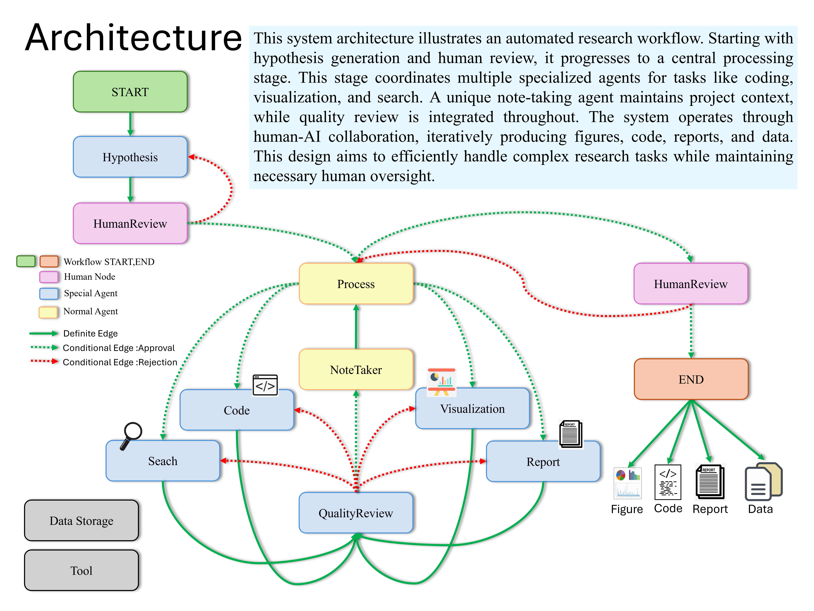

# DATAGEN (原 AI-Data-Analysis-MultiAgent)


## 關於 DATAGEN
DATAGEN 是一個強大的品牌名稱，代表我們利用人工智慧技術進行數據生成和分析的願景。這個名稱結合了 "DATA" 和 "GEN"（generation），完美體現了本專案的核心功能——通過多代理系統進行自動化數據分析和研究。



## 概述

DATAGEN 是一個先進的 AI 驅動數據分析和研究平台，利用多個專業代理來簡化數據分析、可視化和報告生成等任務。我們的平台運用尖端技術，包括 LangChain、OpenAI 的 GPT 模型和 LangGraph，來處理複雜的研究流程，整合多樣化的 AI 架構以實現最佳性能。

## 主要功能

### 智能分析核心
- **進階假設引擎**
  - AI 驅動的假設生成和驗證
  - 自動化研究方向優化
  - 即時假設精煉
- **企業級數據處理**
  - 穩健的數據清理和轉換
  - 可擴展的分析管道
  - 自動化品質保證
- **動態可視化套件**
  - 互動式數據可視化
  - 自定義報告生成
  - 自動洞察提取

### 進階技術架構
- **多代理智能**
  - 專門化代理處理多樣化任務
  - 智能任務分配
  - 即時協調和優化
- **智能記憶管理**
  - 最先進的 Note Taker 代理
  - 高效的上下文保留系統
  - 無縫工作流程整合
- **自適應處理管道**
  - 動態工作流程調整
  - 自動化資源優化
  - 即時性能監控

## 為何選擇 DATAGEN

DATAGEN 通過創新的多代理架構和智能自動化功能徹底革新數據分析：

1. **進階多代理系統**
   - 專業代理協調運作
   - 智能任務分配和協調
   - 即時適應複雜分析需求

2. **智能上下文管理**
   - 開創性的 Note Taker 代理用於狀態追蹤
   - 高效的記憶體利用和上下文保留
   - 跨分析階段的無縫整合

3. **企業級性能**
   - 穩健且可擴展的架構
   - 一致且可靠的結果
   - 生產就緒的實現

## 系統需求

- Python 3.10 或更高版本

## 安裝

1. 克隆儲存庫：
```bash
git clone https://github.com/starpig1129/DATAGEN.git
```

2. 創建並啟動 Conda 虛擬環境：
```bash
conda create -n datagen python=3.10
conda activate datagen
```

3. 安裝依賴：
```bash
pip install -r requirements.txt
```

4. 設置環境變數：
**將 `.env Example` 重命名為 `.env` 並填入所有值**
```sh
# 您的數據存儲路徑（必需）
DATA_STORAGE_PATH =./data/

# Conda 環境名稱（必需）
CONDA_ENV = datagen

# ChromeDriver 執行檔路徑（必需）
CHROMEDRIVER_PATH =./chromedriver-linux64/chromedriver

# Firecrawl API 金鑰（可選）
# 注意：如果缺少此金鑰，查詢功能可能會受限
FIRECRAWL_API_KEY = XXXXXXXXXXXXXXXXXXXXXXXXXXXXXXXXXXXX

# OpenAI API 金鑰（可選）
OPENAI_API_KEY = XXXXXXXXXXXXXXXXXXXXXXXXXXXXXXXXXXXX
# Anthropic API 金鑰（可選）
ANTHROPIC_API_KEY = XXXXXXXXXXXXXXXXXXXXXXXXXXXXXXXXXXXX
# Google API 金鑰（可選）
GOOGLE_API_KEY = XXXXXXXXXXXXXXXXXXXXXXXXXXXXXXXXXXXX

# LangChain API 金鑰（可選）
# 用於監控處理過程
LANGCHAIN_API_KEY = XXXXXXXXXXXXXXXXXXXXXXXXXXXXXXXXXXXX
```

## 使用方法

### 使用 Python 腳本

您可以使用 main.py 運行系統：

1. 將您的數據文件（例如 YourDataName.csv）放入 data 目錄

2. 修改 main.py 中 main() 函數的 user_input 變數：
```python
user_input = '''
datapath:YourDataName.csv
使用機器學習進行數據分析並撰寫完整的圖形報告
'''
```

3. 運行腳本：
```bash
python main.py
```

## 主要組件

- `hypothesis_agent`：生成研究假設
- `process_agent`：監督整個研究過程
- `visualization_agent`：創建數據可視化
- `code_agent`：編寫數據分析代碼
- `search_agent`：進行文獻和網路搜索
- `report_agent`：撰寫研究報告
- `quality_review_agent`：執行品質審查
- `note_agent`：記錄研究過程

## 工作流程

系統使用 LangGraph 創建狀態圖來管理整個研究過程。工作流程包括以下步驟：

1. 假設生成
2. 人工選擇（繼續或重新生成假設）
3. 處理（包括數據分析、可視化、搜索和報告撰寫）
4. 品質審查
5. 根據需要進行修訂

### Agent 模型配置

用戶可以通過編輯 `config/agent_models.yaml` 文件來自定義每個代理的語言模型提供者和模型配置。這允許根據不同代理需求優化模型選擇和參數。

以下是 `config/agent_models.yaml` 的範例結構：

```yaml
agents:
  hypothesis_agent:
    provider: openai
    model_config:
      model: gpt-5-nano
      temperature: 1.0
  note_agent:
    provider: google
    model_config:
      model: gemini-2.5-pro
      temperature: 1.0
  code_agent:
    provider: anthropic
    model_config:
      model: claude-haiku-4-5
      temperature: 1.0
```

- **provider**：指定要使用的語言模型提供者（例如 openai、google、anthropic、ollama、groq）
- **model_config**：包含模型特定的配置參數
  - `model`：要使用的特定模型名稱
  - `temperature`：控制模型輸出的隨機性（範圍：0.0-2.0）

## 進階配置系統

DATAGEN 實現了強大的**漸進式揭露**架構用於代理配置，靈感來自 [Claude Agent Skills](https://platform.claude.com/docs/agents-and-tools/agent-skills/overview)。

### 文檔

| 指南 | 說明 |
|------|------|
| [系統架構](SYSTEM_ARCHITECTURE.md) | 高階概覽和核心概念 |
| [快速入門](QUICKSTART.md) | 5 分鐘內配置代理 |
| [Agent 配置參考](AGENT_CONFIG.md) | AGENT.md 和 config.yaml 完整參考 |
| [工具配置](TOOL_CONFIG.md) | 可用工具和自定義工具創建 |
| [技能配置](SKILL_CONFIG.md) | 創建和使用可重用知識模組 |
| [MCP 配置](MCP_CONFIG.md) | Model Context Protocol 服務設置 |

### 主要功能
- **基於技能的架構**：可重用技能存儲在 `config/skills/`
- **動態工具載入**：通過 `config.yaml` 使用 `ToolFactory` 配置工具
- **Model Context Protocol (MCP)**：外部服務器整合（檔案系統、GitHub、網頁搜索）
- **漸進式揭露**：三級載入策略優化 Context Window

## 注意事項

- 確保您有足夠的 API 額度，因為系統會進行多次 API 調用。
- 根據任務的複雜性，系統可能需要一些時間來完成整個研究過程。
- **警告**：代理系統可能會修改正在分析的數據。強烈建議在使用本系統前備份您的數據。

## 當前問題與解決方案
1. NoteTaker 效率改進
2. 整體運行時間優化
3. Refiner 需要改進

## 貢獻

歡迎提交 Pull Request。對於重大更改，請先開啟 Issue 討論您想要更改的內容。

## 授權

本專案採用 MIT 授權 - 詳見 [LICENSE](../../LICENSE) 文件。

## Star 歷史

[](https://star-history.com/#starpig1129/DATAGEN&Date)

## 其他專案
以下是我其他值得注意的專案：

### ShareLMAPI
ShareLMAPI 是一個本地語言模型共享 API，使用 FastAPI 提供接口，允許不同程式或設備共享同一個本地模型，從而減少資源消耗。它支持流式生成和各種模型配置方法。
- GitHub: [ShareLMAPI](https://github.com/starpig1129/ShareLMAPI)

### PigPig：進階多模態 LLM Discord 機器人
一個基於多模態大型語言模型（LLM）的強大 Discord 機器人，設計用於通過自然語言與用戶互動。它結合了先進的 AI 功能和實用功能，為 Discord 社群提供豐富的體驗。
- GitHub: [ai-discord-bot-PigPig](https://github.com/starpig1129/ai-discord-bot-PigPig)
